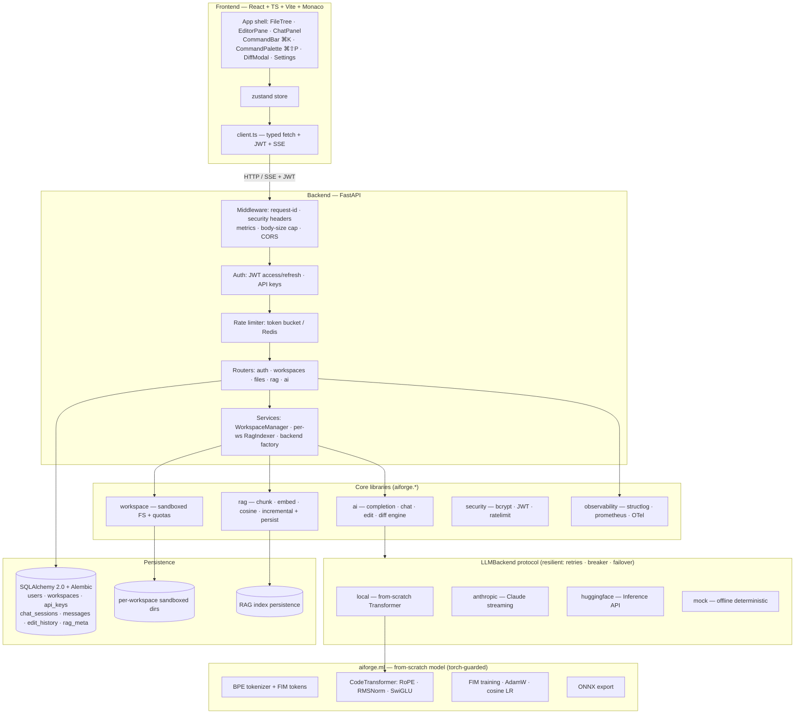

# Architecture

aiforge-editor is a web-based, AI-native code editor: a React + Monaco frontend
talking to a Python/FastAPI backend that provides AI features (inline
completion, codebase chat, agentic edits) over sandboxed, per-user workspaces,
with a codebase RAG index and a from-scratch code-completion model.

## Request lifecycle

1. **Middleware** assigns a request id (propagated into every structured log
   line), records Prometheus latency/count, sets security headers, and rejects
   oversized bodies.
2. **Auth dependency** resolves the caller from a JWT *or* an API key (both are
   Bearer tokens); a 401 triggers a transparent refresh-and-retry on the client.
3. **Rate limiting** (token bucket, per user/IP; Redis-backed across replicas)
   gates general and AI endpoints separately.
4. **Workspace resolution** maps `{workspace_id}` to a row owned by the caller
   (404 otherwise) and hands the handler a filesystem sandbox scoped to that
   workspace's isolated root.
5. **Handlers** call the core libraries; AI handlers stream SSE with heartbeats
   and client-disconnect cancellation.

## Multi-tenancy & isolation

Every user owns one or more **workspaces**. Each workspace has a distinct,
server-generated directory under `<data_dir>/workspaces/<root_dir>`. The
`Workspace` sandbox confines all path resolution to that root and rejects `..`
traversal, absolute paths, NUL/control chars, and symlink escapes. Because each
workspace has a separate root, one user's paths can never resolve into another's
— this is the structural guarantee behind tenant isolation, and it's tested in
`tests/test_isolation.py`.

## LLM layer

A single `LLMBackend` protocol (`complete(request) -> Iterator[str]`) has four
implementations: `mock` (offline, deterministic — the default and the test
floor), `local` (our from-scratch model), `anthropic` (Claude, streaming), and
`huggingface`. The `ResilientBackend` wraps an ordered chain with tenacity
retries, a per-provider circuit breaker, and failover (e.g. anthropic → hf →
mock), so a provider outage degrades gracefully instead of failing the request.
Inline completion can be routed to the local model while chat/edit stay on
Claude in production.

## The diff engine

Agentic edits never trust a model to emit a perfect diff. `propose_edit` asks
for the full new content and computes the unified diff locally; `apply_edit`
applies it with a pure-Python parser/applier that verifies hunk context
(fuzzily relocating within a bounded window if the file drifted), applies hunks
bottom-up, and can **reverse** any diff for undo. Multi-file edits apply
atomically (all hunks resolved before any write). This is the most heavily
unit-tested module (`tests/test_diff.py`).

## RAG

`RagIndexer` walks a workspace, chunks Python by `def`/`class` (other languages
by overlapping line windows), embeds each chunk with a deterministic hashing
embedder (or real sentence-transformers when installed), and stores vectors in a
numpy cosine store. It supports **incremental** re-indexing (per-file content
hashes; only changed files re-embedded) and **persistence** to disk. Search
returns chunks with file + line provenance for "jump to source" in chat.

## The from-scratch model (`aiforge.ml`)

A decoder-only Transformer (RoPE, RMSNorm, SwiGLU, own attention) trained with a
fill-in-the-middle objective on a stdlib + repo code corpus. See
[`backend/aiforge/ml/README.md`](backend/aiforge/ml/README.md). torch is
import-guarded so the API and CI run without it.

## Observability

structlog emits JSON logs carrying the request id; Prometheus `/metrics`
exposes HTTP latency, completion/chat counters, token & cost by provider, edits
applied, and index size; OTel spans are emitted when the optional packages are
present (no-op otherwise). `/health` is liveness; `/ready` checks the DB.
