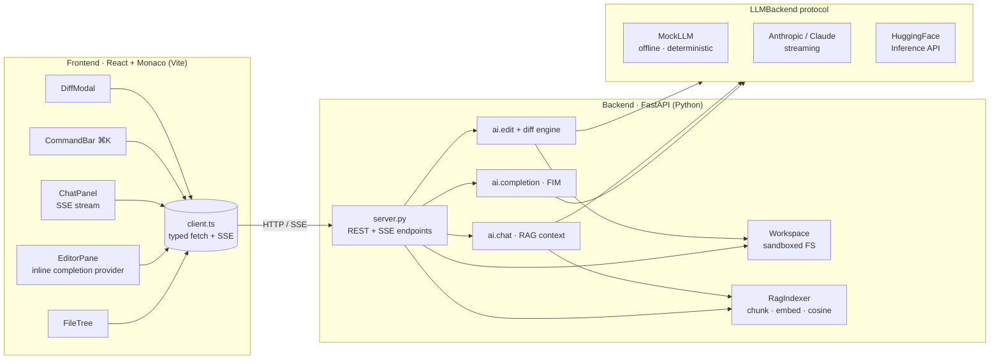

<div align="center">

# ✦ aiforge-editor

**An open-source, AI-native code editor.** A VS-Code-like React + Monaco frontend
talking to a Python/FastAPI backend that provides inline completion, codebase
chat, and agentic edits over your project — backed by a real codebase RAG index.

[](.github/workflows/ci.yml)
[](LICENSE)
[](backend/pyproject.toml)
[](frontend/package.json)
[](backend/aiforge/llm)
[](#how-the-ai-features-work)

</div>

---

## Why aiforge

Most "AI editors" are closed boxes. aiforge is a small, readable, fully
open implementation of the pieces that matter:

- A **real inline completion** path (fill-in-the-middle around the cursor),
  wired into Monaco's inline-suggestion provider.
- A **codebase chat** that retrieves relevant code via a RAG index and streams
  a grounded answer with clickable source references.
- An **agentic edit** flow: type an instruction, preview the exact unified
  diff, accept or reject. The diff is applied by a **genuinely correct,
  unit-tested unified-diff engine written in pure Python** — not a "trust the
  model to emit perfect diffs" hack.
- A pluggable LLM layer (**Claude / HuggingFace / Mock**) behind one protocol.
  **The whole thing runs offline with no API key** via a deterministic
  `MockLLM`, so the demo and the entire test suite work with zero setup.

## Feature list

| Feature | What it does | Where |
|---|---|---|
| 📁 **File tree** | Sandboxed workspace explorer, opens files into tabs | `frontend/.../FileTree.tsx`, `backend/.../workspace/files.py` |
| ✍️ **Multi-tab editor** | Monaco editor, dirty tracking, `Cmd/Ctrl+S` save | `frontend/.../EditorPane.tsx` |
| 💡 **Inline AI completion** | FIM completion at the cursor via Monaco's inline provider → `/api/complete` (SSE) | `EditorPane.tsx`, `backend/.../ai/completion.py` |
| 💬 **Codebase chat** | RAG-grounded Q&A, streamed answer, "jump to source" refs, "apply code to file" | `ChatPanel.tsx`, `backend/.../ai/chat.py` |
| ⌘K **Agentic edit** | Instruction → diff preview modal → accept/reject → apply | `CommandBar.tsx`, `DiffModal.tsx`, `backend/.../ai/edit.py` |
| 🔎 **Codebase RAG** | Structural chunking + hashing embeddings + cosine search, offline | `backend/.../rag/indexer.py` |
| 🧩 **Diff engine** | Pure-Python unified-diff parse / apply / reverse, fuzzy relocate | `backend/.../ai/diff.py` |
| 🔌 **Pluggable LLMs** | Claude (streaming), HuggingFace, deterministic Mock | `backend/.../llm/` |
| 🛡️ **Sandboxed FS** | Path-traversal & symlink-escape protection on every file op | `backend/.../workspace/files.py` |

### Screenshots (described)

The UI is a dark, three-pane VS-Code-style shell:

```
┌──────────────────────────────────────────────────────────────────────────────┐
│ ✦ aiforge          AI-native code editor                                       │  ← titlebar (gradient logo)
├────────────┬───────────────────────────────────────────────┬──────────────────┤
│ EXPLORER ⟳⚡│  calculator.py ● │ auth.py                     │ AI CHAT          │
│ ▾ 📁 src   │ ───────────────────────────────────────────────│ ──────────────── │
│   📄 auth  │  1  def fibonacci(self, n):                     │ user             │
│   📄 calc ●│  2      prev, curr = 0, 1                       │  How does the    │
│ 📄 README  │  3      for _ in range(n):                      │  password hash   │
│            │  4          prev, curr = curr, prev+curr        │  work?           │
│            │  5      return prev                             │ assistant        │
│            │       ░ ghost text: inline AI completion ░      │  It uses SHA-256 │
│            │                                                 │  ```python ...```│
│            │                                                 │  [apply to file] │
│            │                                                 │  references:     │
│            │                                                 │  src/auth.py:6-8 │
├────────────┴───────────────────────────────────────────────┴──────────────────┤
│ indexed 3 files / 8 chunks (hashing)   RAG:3f/8c   calc.py ●   ⌘K edit · ⌘S    │  ← status bar
└──────────────────────────────────────────────────────────────────────────────┘
```

Pressing **⌘K** drops a command bar from the top:

```
        ┌──────────────────────────────────────────────┐
        │ ✦ edit  Instruct an edit to calculator.py…  [Propose] │
        └──────────────────────────────────────────────┘
```

…which opens a **diff preview modal** (added lines green, removed red) with
**Reject** / **Accept & Apply**.

## Architecture



The contract between the panes:

- **Inline completion** — `EditorPane` registers a Monaco
  `InlineCompletionsProvider` that sends `{prefix, suffix}` around the cursor to
  `POST /api/complete` and inserts the streamed result as ghost text.
- **Chat** — `ChatPanel` streams `POST /api/chat`; `token` events build the
  answer, a `meta` event delivers RAG references.
- **Agentic edit** — `CommandBar` calls `POST /api/edit` to get a unified diff,
  `DiffModal` previews it, **Accept** calls `POST /api/edit/apply`.

## Quickstart

> Everything below works **with no API key** — the default backend is a
> deterministic offline `MockLLM`. Add a key only when you want real models.

### 1 — Backend

```bash
cd backend
python -m venv .venv && source .venv/bin/activate
pip install -r requirements.txt        # or requirements-min.txt for offline-only

# Point the editor at a project to edit (any directory).
export AIFORGE_WORKSPACE_ROOT=../backend/tests/sample_project

# Run it (offline mock backend by default).
uvicorn aiforge.api.server:app --reload --port 8000
#   → http://localhost:8000/health   → http://localhost:8000/docs
```

Run the test suite (fully offline, no key):

```bash
cd backend
pip install -r requirements-min.txt
pytest -q          # 48 tests: workspace, RAG, diff engine, AI features, API
```

### 2 — Frontend

```bash
cd frontend
npm install
npm run dev        # → http://localhost:5173  (proxies /api → :8000)
```

Open `http://localhost:5173`, open a file from the explorer, and:
- start typing to get **inline completions**,
- press **⌘/Ctrl+K** to issue an **agentic edit**,
- ask a question in the **AI chat** panel.

### 3 — Docker (both services)

```bash
docker compose up --build
#   frontend → http://localhost:8080   backend → http://localhost:8000
```

### Using real models

```bash
# Claude (primary)
export AIFORGE_BACKEND=anthropic
export ANTHROPIC_API_KEY=sk-ant-...

# or HuggingFace Inference API (secondary)
export AIFORGE_BACKEND=huggingface
export HF_TOKEN=hf_...
```

## How the AI features work

**Backends** implement a single `LLMBackend` protocol (`complete(request) ->
Iterator[str]`):

- **`MockLLM`** (default) — offline & deterministic. It recognises the prompt
  shapes built by `aiforge.ai` and returns plausible code, answers, and edits,
  so the UI and the entire test suite run with zero credentials.
- **`AnthropicBackend`** — the official `anthropic` SDK with real streaming
  (`client.messages.stream`). Per-feature models: Haiku 4.5 for low-latency
  completion, Sonnet 4.6 for chat, Opus 4.8 for agentic edits.
- **`HuggingFaceBackend`** — the HF Inference API over `httpx` (default
  `Qwen/Qwen2.5-Coder-7B-Instruct`).

**Inline completion** builds a fill-in-the-middle prompt from the text before
and after the cursor and streams only the text to insert.

**Chat** retrieves the top-k code chunks for the question (plus the open file)
from the RAG index, assembles them into the system prompt, and streams a
grounded answer with file:line references.

**Agentic edit** asks the model for the *full new file content*, then computes a
unified diff locally (more robust than trusting model-emitted diffs). The diff is
previewed and, on accept, applied by the pure-Python diff engine. The engine:

- parses standard unified diffs (`--- / +++ / @@` hunks),
- verifies context/removed lines against the source and **fuzzily relocates** a
  hunk within a bounded window if the file drifted,
- applies hunks bottom-up so offsets stay valid,
- and can **reverse** a diff for undo.

All of this is unit-tested with apply ⇄ reverse round-trips.

**Codebase RAG** walks the workspace, chunks Python by `def`/`class` (other
languages and leftovers by overlapping line windows), embeds each chunk with a
deterministic **hashing embedder** (feature hashing + L2 norm — no model
download, no network), stores vectors in a numpy cosine store, and answers
`search(query, k)` with file + line provenance. An optional
`sentence-transformers` embedder is used automatically *if installed* and
enabled in config.

## Keybindings

| Keys | Action |
|---|---|
| `Cmd/Ctrl` + `S` | Save the active file |
| `Cmd/Ctrl` + `K` | Open the agentic-edit command bar |
| `Esc` | Close the command bar / dismiss a modal |
| `Enter` (chat) | Send the message (`Shift+Enter` = newline) |
| Type in editor | Trigger inline AI completion (accept with `Tab`) |

## Configuration

All settings are environment variables prefixed `AIFORGE_` (see
[`.env.example`](.env.example)). Highlights:

| Variable | Default | Purpose |
|---|---|---|
| `AIFORGE_BACKEND` | `mock` | `mock` \| `anthropic` \| `huggingface` |
| `AIFORGE_WORKSPACE_ROOT` | `./workspace` | The sandboxed project directory |
| `AIFORGE_MODEL_COMPLETE` | `claude-haiku-4-5` | Model for inline completion |
| `AIFORGE_MODEL_CHAT` | `claude-sonnet-4-6` | Model for chat |
| `AIFORGE_MODEL_EDIT` | `claude-opus-4-8` | Model for agentic edit |
| `AIFORGE_RAG_TOP_K` | `6` | Chunks retrieved per query |
| `AIFORGE_RAG_EMBED_DIM` | `512` | Hashing-embedder dimension |
| `AIFORGE_RAG_USE_SENTENCE_TRANSFORMERS` | `false` | Use ST embeddings if installed |
| `AIFORGE_CORS_ORIGINS` | dev origins | Comma-separated allowed origins |
| `AIFORGE_FRONTEND_DIST` | _(unset)_ | Serve a built SPA from `/` in prod |
| `ANTHROPIC_API_KEY` / `HF_TOKEN` | _(unset)_ | Vendor keys (env-only, never hardcoded) |

### API surface

| Method | Path | Purpose |
|---|---|---|
| `GET` | `/health` | Liveness + backend/index status |
| `GET` | `/api/tree` | Workspace file tree |
| `GET` | `/api/file?path=` | Read a file |
| `PUT` | `/api/file` | Save a file |
| `POST` | `/api/file` | Create a file |
| `DELETE` | `/api/file?path=` | Delete a file |
| `POST` | `/api/complete` | Inline completion (SSE) |
| `POST` | `/api/chat` | Codebase chat (SSE, with references) |
| `POST` | `/api/edit` | Propose an agentic edit (returns a diff) |
| `POST` | `/api/edit/apply` | Apply a proposed diff / full content |
| `POST` | `/api/index` | Build the RAG index |
| `GET` | `/api/search?q=&k=` | RAG search |

## Project tree

```
aiforge-editor/
├── README.md                 · this file
├── LICENSE                   · MIT (2026 OCT0PUSPR)
├── .gitignore
├── .env.example
├── docker-compose.yml
├── .github/workflows/ci.yml  · backend lint+pytest (offline) · frontend typecheck/build
├── backend/
│   ├── pyproject.toml
│   ├── requirements.txt · requirements-min.txt
│   ├── Dockerfile
│   ├── aiforge/
│   │   ├── config.py             · env-driven settings (pydantic-settings)
│   │   ├── llm/                  · base protocol + anthropic / hf / mock backends
│   │   ├── workspace/files.py    · sandboxed FS (path-traversal protection)
│   │   ├── rag/indexer.py        · chunk · hashing embed · cosine store · search
│   │   ├── ai/
│   │   │   ├── completion.py     · fill-in-the-middle
│   │   │   ├── chat.py           · RAG-grounded chat
│   │   │   ├── edit.py           · propose / apply agentic edits
│   │   │   └── diff.py           · unified-diff parse · apply · reverse
│   │   └── api/server.py         · FastAPI app (REST + SSE)
│   └── tests/                    · pytest (offline) + sample_project fixture
└── frontend/
    ├── package.json · vite.config.ts · tsconfig*.json · index.html
    ├── Dockerfile · nginx.conf
    └── src/
        ├── main.tsx · App.tsx · store.ts · language.ts · styles.css
        ├── api/client.ts        · typed fetch + SSE helpers
        ├── components/          · FileTree · EditorPane · ChatPanel · CommandBar · DiffModal · StatusBar
        └── __tests__/           · vitest (SSE parser)
```

## Roadmap

- [ ] Multi-file agentic edits (whole-change-set diff preview)
- [ ] Streaming inline completion (render ghost text as tokens arrive)
- [ ] Persisted RAG index (on-disk cache + incremental re-index on save)
- [ ] Git integration (stage/commit applied edits, real undo via reverse diffs)
- [ ] `@file` / `@symbol` mentions in chat
- [ ] Embeddings upgrade path (sentence-transformers / external vector DB)
- [ ] LSP diagnostics surfaced into chat context

## License

[MIT](LICENSE) © 2026 OCT0PUSPR.
